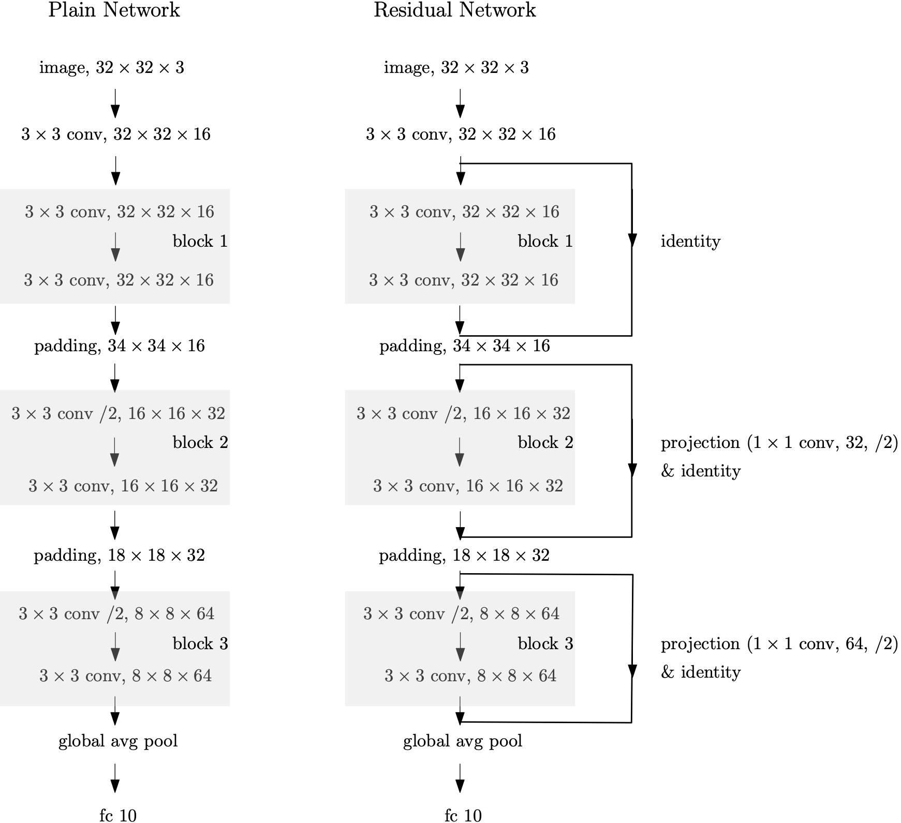
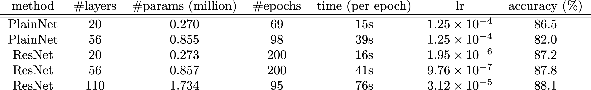

## **Learning**

----

**[ResNets on CIFAR-10](https://github.com/DrMMZ/drmmz.github.io/blob/master/ResNet/ResNet.py)**

Using TensorFlow, we implement residual networks from [He et al, Deep Residual Learning for Image Recognition](https://arxiv.org/abs/1512.03385), as well as plain networks. We compare plain 20/56-layers, residual 20/56/110-layers networks on the [CIFAR-10 dataset](https://www.cs.toronto.edu/~kriz/cifar.html).

The plain and residual architectures are shown in the below [figure](https://github.com/DrMMZ/drmmz.github.io/blob/master/ResNet/architectures.png).

<figure>
  
</figure>

All networks use 3 × 3 convolutions and contain 3 blocks. Each block can be repeated by n times and has the number of filters in {16, 32, 64} such that if the feature map size is halved (denoted by /2 in the above figure), the number of filters is doubled. The networks end with a global average pooling layer and a 10-unit fully-connected layer. For residual architecture, we use identity shortcuts in the block 1, and a mixed of projection and identity shortcuts in the block 2 and 3, which is different from [He et al, Deep Residual Learning for Image Recognition](https://arxiv.org/abs/1512.03385) where they use identity shortcuts in all blocks.

For training, we use Adam optimizer with the initial learning rate 0.001 (𝛽1 = 0.9, 𝛽2 = 0.999), halved whenever the validation loss is not decreasing for 10 consecutive epochs. These models are trained on Google Colab GPU with a mini-batch size of 128 for a 45k/5k train/val split, maximal 200 epochs and early stopping when the validation loss is not decreasing for 30 consecutive epochs. We also apply L2-regularization with a strength of 0.001, batch normalization, He initialization and data augmentation, i.e., 4 pixels padding on each side followed by 3 × 3 crop or horizontal flip. 

These lead to the following [results](https://github.com/DrMMZ/drmmz.github.io/blob/master/ResNet/results.png).

<figure>
  
</figure>

----

**[Sequential Convolutional Neural Networks](https://github.com/DrMMZ/drmmz.github.io/blob/master/ConvNet.ipynb)**

Using TensorFlow and GPU, we experiment with different ConvNet architectures on the [CIFAR10](http://www.cs.toronto.edu/~kriz/cifar.html) dataset, which consists of 50k training images and 10k testing images in 10 classes. The final model took inspiration from [VGG](https://arxiv.org/abs/1409.1556) that achieves above 70% accuracy on the testing images within 10 epochs training with a mini-batch size of 64 using default Adam optimizer. In particular, the architecture is the following:

*(Conv32-BatchNorm-ReLU) × 2 - MaxPool - (Conv64-BatchNorm-ReLU) × 3 - MaxPool - (Conv128-BatchNorm-ReLU) × 3 - MaxPool - FullyConnected × 2*

----

**[Classification on Imbalanced Structured Data using Fully Connected Neural Networks](https://github.com/DrMMZ/drmmz.github.io/blob/master/NN_ImbalancedStructured.ipynb)**

This work uses the [data](https://archive.ics.uci.edu/ml/datasets/Bank+Marketing) that were collected from a marketing campaign (i.e., phone calls) related with bank deposit subscription. The goal is to predict whether or not the client will subscribe a term deposit. See the original paper published in [Moro et al., 2014](http://dx.doi.org/10.1016/j.dss.2014.03.001).

We first analyze features given by the data in [Bank Marketing - EDA](http://htmlpreview.github.io/?https://github.com/DrMMZ/drmmz.github.io/blob/master/bank_EDA.nb.html), which is done by R.

Since the data is imbalanced, oversampling and undersampling methods are used on training data. After tuning hyperparameters, the undersampled model (2-layer neural network with 20 hidden units, ReLU activation and adam optimization) has results in AUC 0.957 and recall 0.940. We also use batch normalization to speed up training and L1-regularization to reveal several key features. At the end, error analysis is provided. This part is done by Python. See the [notebook](https://github.com/DrMMZ/drmmz.github.io/blob/master/NN_ImbalancedStructured.ipynb) for the work. 

For the business purpose, the shallow 2-layer neural network model can predict the success of telemarketing calls for selling bank deposits. Such model can increase campaign efficiency by helping in a better selection of a high quality and affordable list of potential buying customers.

----

**[TensorFlow Implementation of Fully Connected Neural Networks](https://github.com/DrMMZ/drmmz.github.io/blob/master/NN_tensorflow.ipynb)**

Implemented in TensorFlow a fully connected L-layer ReLU neural network for any integer L>0 with L1 or L2-regularization, dropout, batch normalization, different optimization methods and loss functions.

----

**[NumPy Implementation of Fully Connected Neural Networks](https://github.com/DrMMZ/drmmz.github.io/blob/master/NN_numpy.ipynb)**

Implemented a vectorized fully connected L-layer ReLU network for any integer L>0 with L1 or L2-regularized softmax loss and stochastic gradient descent in Numpy.

The implementation is based on *Derivatives in fully connected neural networks* by Ming Ming Zhang. In addition, numeric stability and gradients checking are added.

----

**[Movie Recommendations](http://htmlpreview.github.io/?https://github.com/DrMMZ/drmmz.github.io/blob/master/Movies.nb.html)**

Implemented in R the collaborative filtering with regularized mean square loss function and Quasi-Newton (BFGS) optimization. Then applied to a [dataset of movie ratings](https://grouplens.org/datasets/movielens/), tested on the author’s ratings and made personal movie recommendations.

----

**[Is grade of failure related to class schedule?](http://htmlpreview.github.io/?https://github.com/DrMMZ/drmmz.github.io/blob/master/School.html)**

Applied SQL technique on a dataset extracted from a [database](https://www.kaggle.com/Madgrades/uw-madison-courses). Since the assumptions of analysis of variance (ANOVA) test for our data are not met, used the Kruskal–Wallis test to discern whether there were real differences between the grade of failure rate of postsecondary students according to their class schedule.
